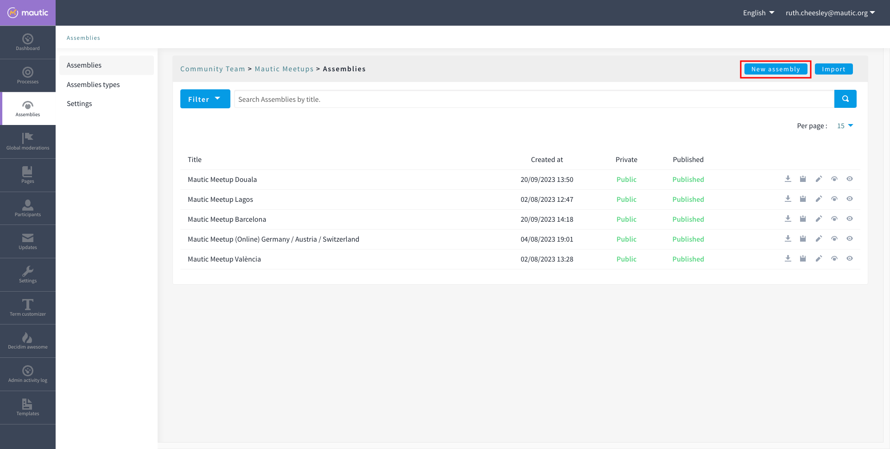
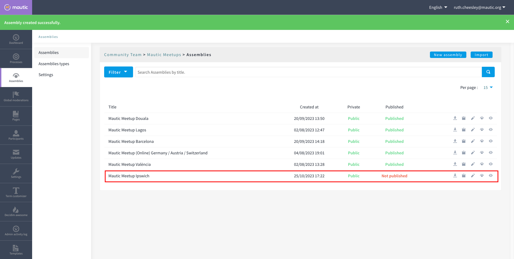
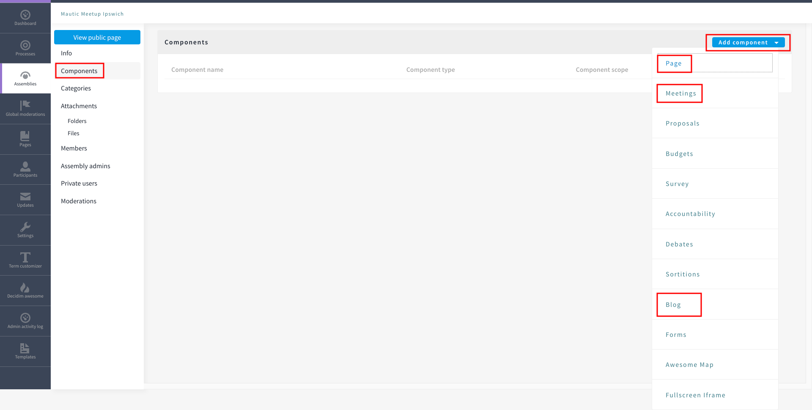
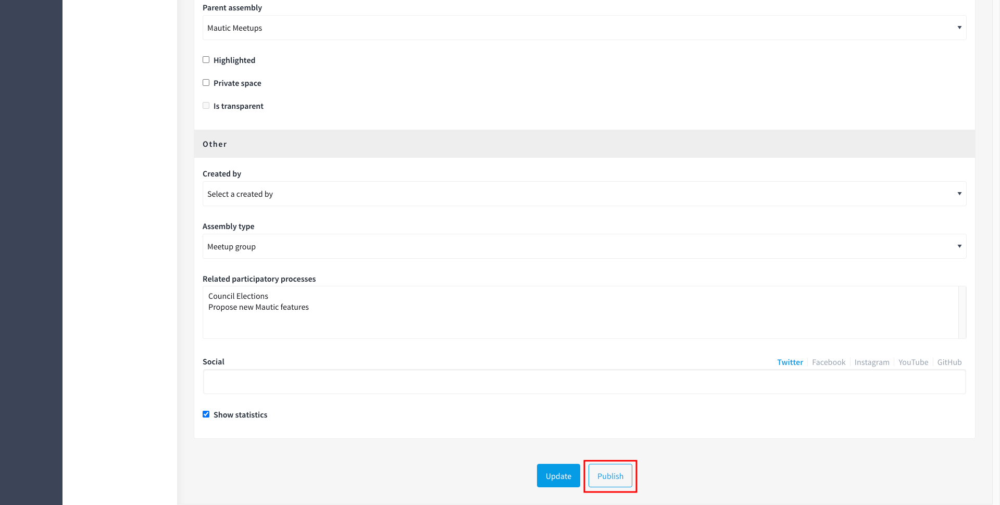

An assembly is a grouping of people who come together to make decisions about specific things or to run different parts of the community.

We have different reasons for having assemblies. So some of them are relating to decision making and governance - such as the Council and the General Assembly - but there are also assemblies for Teams, Meetup Groups and Working Groups as well.

An assembly can also have assemblies nested within it - for example the MautiCon Working Group is nested within the Community Team, because that is the team in which it belongs. 

>>> The main difference between participatory processes and assemblies is that assemblies don’t have phases, meaning that they don’t have timelines.

## How to create a new assembly

The first step before you create an assembly, is to decide what the parent assembly should be.

We have several top-level assemblies:

* Community Team
* Education Team
* Legal and Finance Team
* Marketing Team
* Product Team
* Council
* General Assembly

Think carefully before you create a new top-level assembly - usually it should nest within one which already exists.  Remember that assemblies can be created within assemblies at any level of nesting - for example we have:

_Community Team > Mautic Meetups > Mautic Meetup cityname_

Once you have decided where the new assembly should sit, follow this process to create the assembly:

1. Log in as an administrator
2. Browse to the Assemblies section in the administrators portal
3. Find the assembly which you want as your parent assembly - note that this icon will be black if there are sub-assemblies within the assembly, clicking it will reveal the list of sub-assemblies.

4. Click on the assemblies icon (as above) of the parent assembly
5. Click on 'new assembly' - in this case I am creating a new assembly within the Mautic Meetups assembly, which is within the Community Team assembly.

6. Complete the form
  * Check the[ Decidim docs](https://docs.decidim.org/en/develop/admin/spaces/assemblies#_new_assembly_form) for an explanation of the fields.  
  * Please follow existing naming conventions when it comes to the URL slug and hashtag.
  * Please use [this template](https://www.canva.com/design/DAFvp3RX9E4/t7lTTciFvSBcdA_94XbTiQ/view) to create the image for the assembly on Canva.
  * Please select the scope that relates to the top-level assembly for your assembly - for example for Mautic Meetup groups this would be Community Team. This helps with searching and filtering.
  * Please don't highlight the assembly unless agreed with the Community Portal working group.
  * If your assembly needs to be invite only as far as who can engage in it, you should be set it to private. This means you have to maintain a list of '[private participants](https://docs.decidim.org/en/develop/admin/spaces/assemblies/private_participants)' who can engage in the assembly.  This is quite an overhead, so it should only be used where absolutely essential. This is used in the General Assembly for example.  If this is required it is highly recommended that you also set the assembly to transparent, so that the community can _see_ what happens in the space, if they can't engage.  Private participants will receive an invitation to join the assembly, which they must accept.
  * Ensure the assembly type is selected from the dropdown options.

7. Once the form is saved successfully, go back to the list and you'll notice it's showing as unpublished.

8. Click the pencil icon to configure the assembly
9. Add the components you require by clicking on components > Add Component - generally most assemblies will require:
  * Page (to explain in more detail what they do)
  * Meetings (for online/hybrid/in-person meetings)
  * Blog (to communicate with the community what your assembly is doing)

10. Add the Lead, Assistant Lead and any contributors under the Members section by searching for the existing user. Note you can also create your own role name using 'other' as the option when selecting a role.
11. If you want people to be able to become a member of your assembly _without_ you needing to manually add them, you can create a group which they can join, automatically granting them membership to your assembly.  Check the [documentation on groups](https://contribute.mautic.org/community-portal/groups) for how to create them, and then add the group in the Members section as above.
12. Add any assembly admins - this gives the user full admin rights over just this specific assembly. You will need to know the email address they use, which you can find via Admin panel > Participants > Participants > Show email address (icon resembles an open envelope).
13. Once all is configured, go to Info on the left menu when configuring the assembly, and click the Publish button at the very bottom of the page.

13. If the assembly is private, you'll need to invite members in the 'private members' section, once the assembly is published.

### Assembly types

Currently the following assembly types are available:

* Team
* Working group
* Tiger team
* Governance
* Meetup group