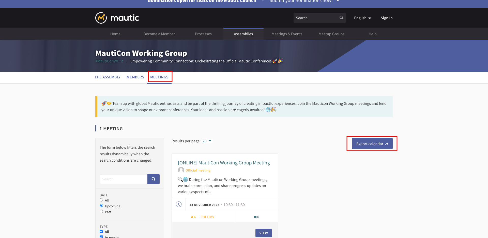
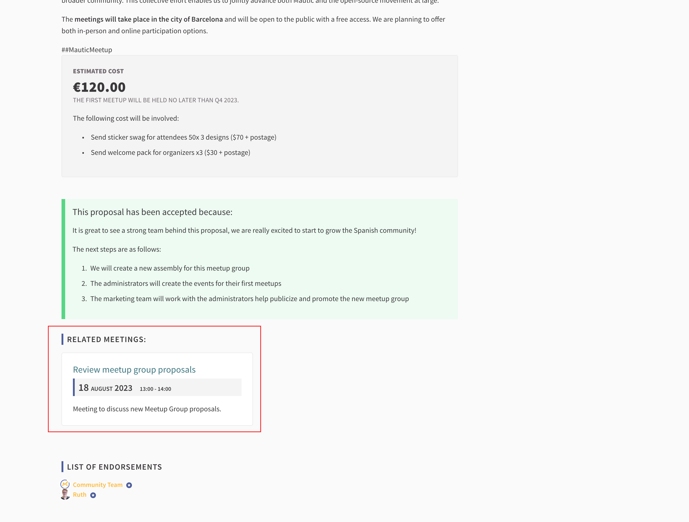

## About meetings

Meetings are where people come together to discuss or inform about a given topic. All the meetings have a given location - where the meeting happens, which could be online - and start and end date/time.

### Types of meetings

Regarding the location, depending on the configuration of the meetings component, you can have:

* **In-person meetings:** where you get together in a given physical location.

* **Online meetings:** where you get together using an external service - for instance Zoom or Jitsi Meet - the event allows attendees to access the meeting in the minutes before it starts and throughout the meeting via the event page.

* **Hybrid meetings:** where there is an online meeting which is also streamed online.

### Subscribing to calendars
If you wish to receive notification of all meetings relating to an entity in the Community Portal, whether that's an Assembly or a Process, click the meetings tab and then Export Calendar. This provides you with a link to add the calendar in your tool of choice.

To subscribe to all events site-wide, follow the same process but use the Meetings & Events menu item on the main menu.

## Creating a meeting

To create a meeting you need to log in as an administrator.

1. Go to the administrator's panel at [https://community.mautic.org/admin](https://community.mautic.org/admin) and find your assembly
2. Click on the meetings component
3. Click new meeting and fill out the form - review the [Decidim documentation](https://docs.decidim.org/en/develop/admin/components/meetings.html#_create_a_new_meeting) for guidance on the different form fields.
4. Ensure that you select the 'open in a new tab' option in the embed dropdown when using online meeting links such as Zoom.

>>> It's not possible at this time to create recurring meetings, but you can very quickly duplicate an existing meeting using the clipboard icon. 

### Registration

Through registrations you can have capacity control of the attendance for a meeting. With this feature, for instance, you can limit how many people could attend to the meeting, or you can know before the start of a meeting if you need to find a bigger room to have the meeting.

Enabling this feature adds a button so that participants can express their wish to go to the meeting. Depending on the configuration:

* It’s possible to define how many slots are available for controlling the maximum capacity for this meeting

* You can configure a custom registration form for asking information from participants 

* Administrators can make invitations to other participants or people that aren’t registered on the platform

* It’s possible to control attendance to the meeting through registration codes - for example if you want to verify attendees have a valid ticket when they arrive at an event.

When registering to attend a meeting, users have the option to show their attendance publicly, and also whether they're attending on behalf of another group.

#### Turning on registrations

To enable registrations for a meeting:

1. Sign in as an administrator at [https://community.mautic.org/admin](https://community.mautic.org/admin)
1. In the main sidebar, click in the button for the space that you want to configure the component for. For instance, it could be 'Processes', 'Assemblies', or 'Conferences'
1. Click on 'Meetings'
1. Search the meeting that you want to enable registrations for
1. Click on the 'Edit' button Edit button
1. Change the 'Registration type' field to 'On this platform' *
1. Define how many slots are available in 'Available slots for this meeting'
1. Click on the 'Update' button
1. Click on the 'Registrations' button Registrations button
1. Check the 'Registrations enabled' checkbox
1. Fill the form

* The default should be to register attendance through the Community Portal but if using an external ticketing system, it's possible to provide a link to the booking page.

### Etherpad note taking

Instead of using external tools for taking notes, Mautic has an [Etherpad](https://etherpad.org/) instance, which is fully integrated with the community portal. This allows for live note taking embedded within meetings - also allowing people to take part asynchronously - which becomes available 24 hours before the meeting starts, and becomes read only 72 hours after the finish time of the event passes. You must first log in to interact on the pad.

1. **Before the meeting:** attendees can review the agenda and add any comments before the meeting starts
2. **During the meeting:** attendees can collaboratively take notes
3. **After the meeting:** you can add notes, minutes, metadata and/or pictures associated with the meeting when closing the meeting, to provide a record of discussions

The pad appears automatically when logged in within the timelines - you don't need to do anything.

The pad iframe is accessible for **24 hours before and 72 hours after the meeting**. After the meeting, the read only pad displays to logged in users.

### Adding an agenda

Please be sure to add an agenda to meetings. It helps people to better understand and prepare for the meeting, and allows you to keep focused when running the meeting.

The agenda feature allows an administrator to define the schedule for a meeting. It’s possible to define agenda items and sub-items, with every one of the topics listed for covering in the meeting, along with a description and the duration of every item and sub-item.

To define an agenda for a meeting:

1. Sign in as administrator at [https://community.mautic.org/admin](https://community.mautic.org/admin)
1. In the main sidebar, click in the button for the space that you want to configure the component for. For instance, it could be 'Processes', 'Assemblies', or 'Conferences'
1. Click on 'Meetings'
1. Search the meeting that you want to add the agenda to
1. Click on the 'Agenda' button 
7. Fill the form

## Running a meeting 

It's a good idea to make an announcement on Slack / Social the day before the meeting to remind people, and also an hour before the meeting starts.

Refer to the agenda, and have someone take notes - rotate this person each meeting - on the Etherpad.

Take note of who is in attendance - individuals, companies, groups represented - and if any proposals discussed, and be sure to record the meeting as appropriate.

## Closing a meeting

After a meeting has passed it’s possible and recommended to close the meeting. This allows you to add the minutes, the notes that gives a summary on the meeting, the agreements reached, decisions made, etc.

This allows you to bring transparency to the meeting and also serves as a record of the different meetings.

It’s also possible to add other kind of metadata to the meeting, such as what organizations have attended, how many attendees and contributions, and the considered proposals.

To close a meeting:

1. Sign in as an administrator at [https://community.mautic.org/admin](https://community.mautic.org/admin)
1. In the main sidebar, click in the button for the space that you want to configure the component for. For instance, it could be 'Processes', 'Assemblies', or 'Conferences'
1. Click on 'Meetings'
1. Search the meeting that you want to close
1. Click on the 'Close' button Close button
1. Fill the form

Please be sure to provide a link to the meeting recording - upload the recordings to the community shared Google Drive.

When you associate a proposal with a meeting, it's also shown in the proposal overview.

