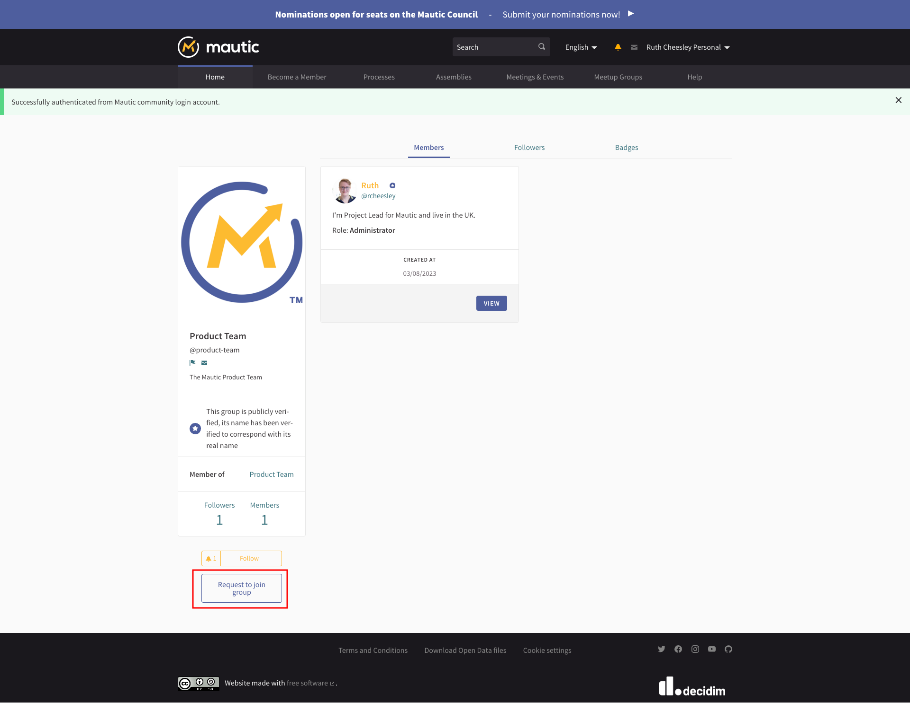
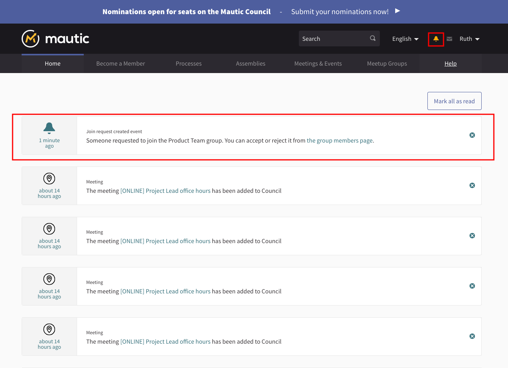
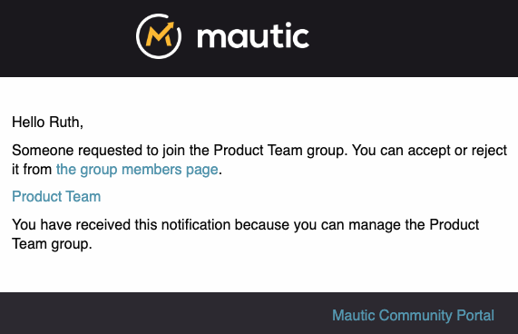
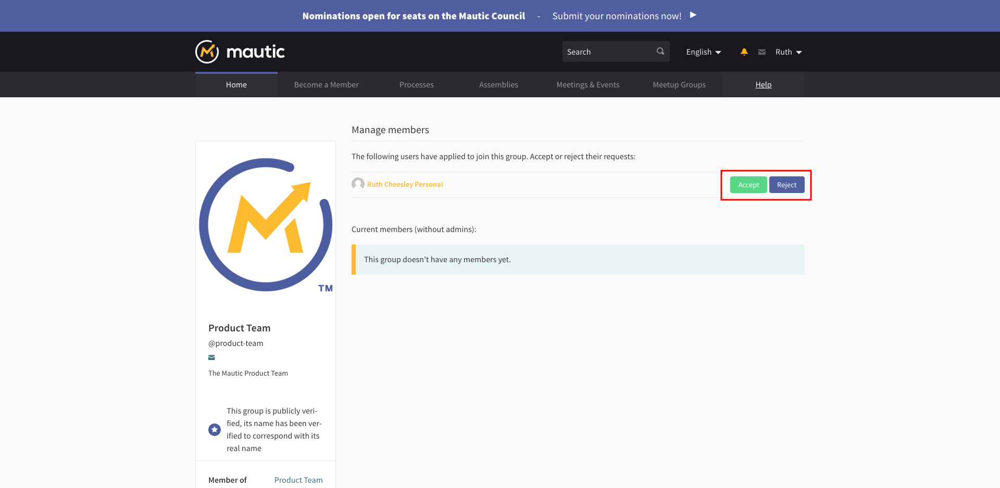
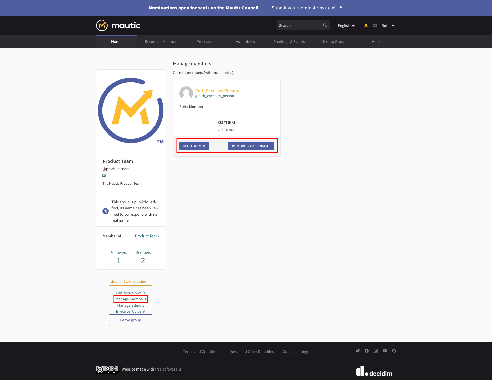
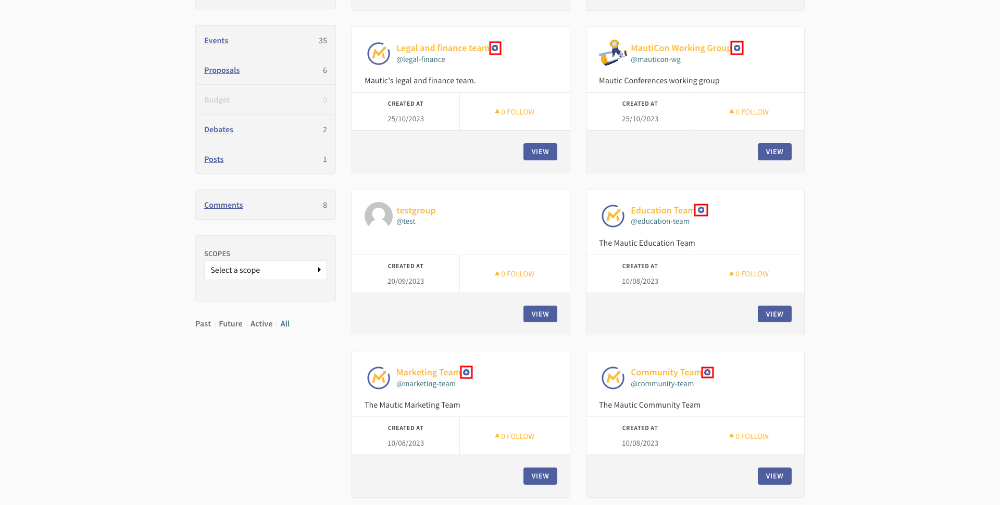
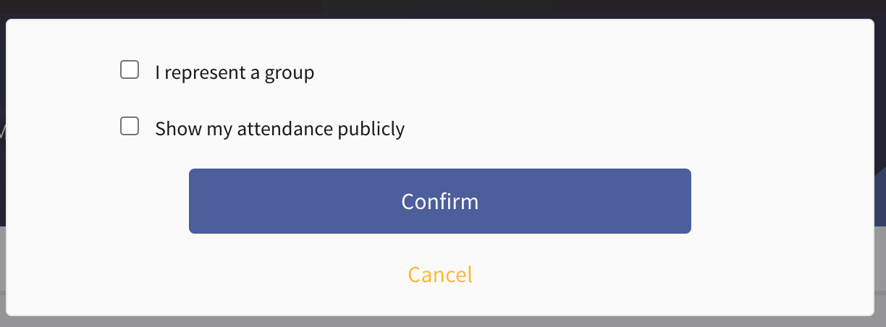

Groups are used in Decidim for several purposes:

* To allow you to participate on behalf of an entity (for example joining a meeting or endorsing a proposal on behalf of your team)
* To allow groups of people to automatically join an assembly by virtue of their group membership
* To allow groups of people to have conversations together

## Joining a group

If you would like to join a team, working group or other entity within the community, the first step is to request to join the group.  This will, when granted, allow you to become a member of the connected assembly as a contributor.

1. Find the group you want to join - either via the assembly homepage, or by [searching for the group](https://community.mautic.org/search?filter%5Bterm%5D=&filter%5Bwith_resource_type%5D=Decidim%3A%3AUserGroup&filter%5Bwith_scope%5D=).
2. Click to request to join the group, and wait for the request to be granted:

## Accepting a member request

When a new member requests to join a group which you are an administrator of, you will receive notification in-app and by email:

Use the link in the notification to jump straight to the request, and click on Accept to allow the request, or reject to prevent the user joining the group.

As soon as the member is approved, they will be added to the group and any related assemblies.

## Managing members

If you need to promote a member to an admin, or remove a member, click on Manage Members within the group, and then click the relevant button.

## Creating a group

Groups have to be created by individuals, and are then verified by the Community Portal Working Group.

1. Go to your public profile, via the user menu.
2. Click on 'Create group' at the bottom left of your user profile:

3. Use the team email address with your group as a suffix - e.g. community-team+portalwg@mautic.org - the team will confirm via email.
4. For official groups, use the Mautic logo for the avatar.
5. Click 'invite participants' to add other members - you will need to know their nickname for the community portal, from their profile:

6. Ensure that you add at least one other administrator, ideally someone from the [Community Portal Working Group](https://community.mautic.org/assemblies/community-portal-working-group/members).

Once created, groups can be found via the Groups menu or when [searching and filtering by Groups](https://community.mautic.org/search?filter%5Bterm%5D=&filter%5Bwith_resource_type%5D=Decidim%3A%3AUserGroup&filter%5Bwith_scope%5D=).

Official groups are indicated by a blue circle with a white star inside.

## Adding a group as a member of an entity

You can add a group in the same way you add a user to an assembly, process, etc. by logging in s an admin, going to the entity in the admin panel and going to Members > Add new member and typing the group name.

Remember that adding the group means that all members of the group become a member of that entity immediately.

## Acting on behalf of a group

When you are an administrator of a group, you have the ability to act on behalf of a group. This might include:

* Attending a meeting or event on behalf of a group
* Endorsing a proposal on behalf of a group

When eligible, you will see a check box which allows you to take action on behalf of the group:

By checking the box, the group name - rather than your name - will be shown in relation to the action (e.g. as an attendee of a meeting, or endorsing a proposal).
