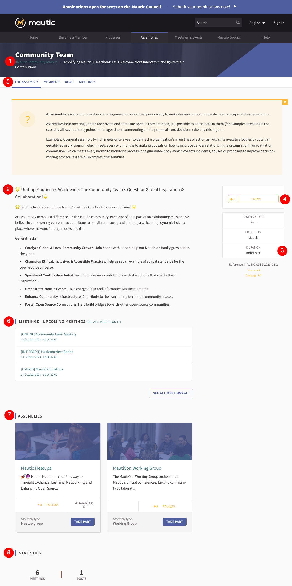
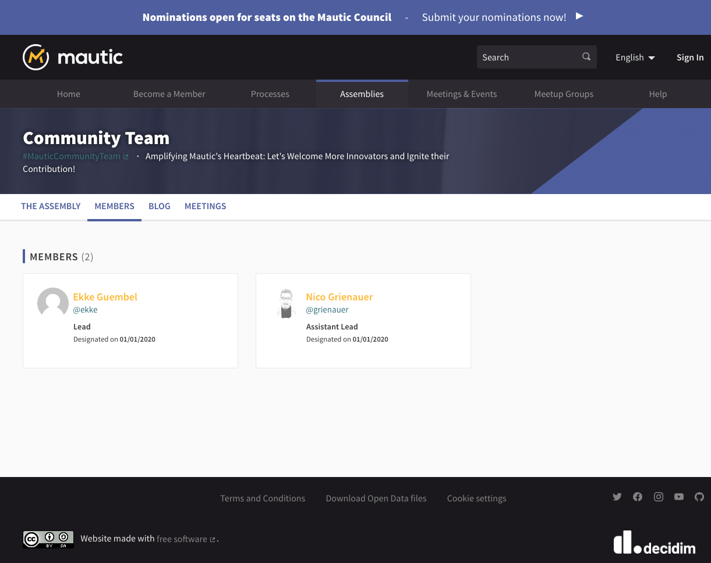
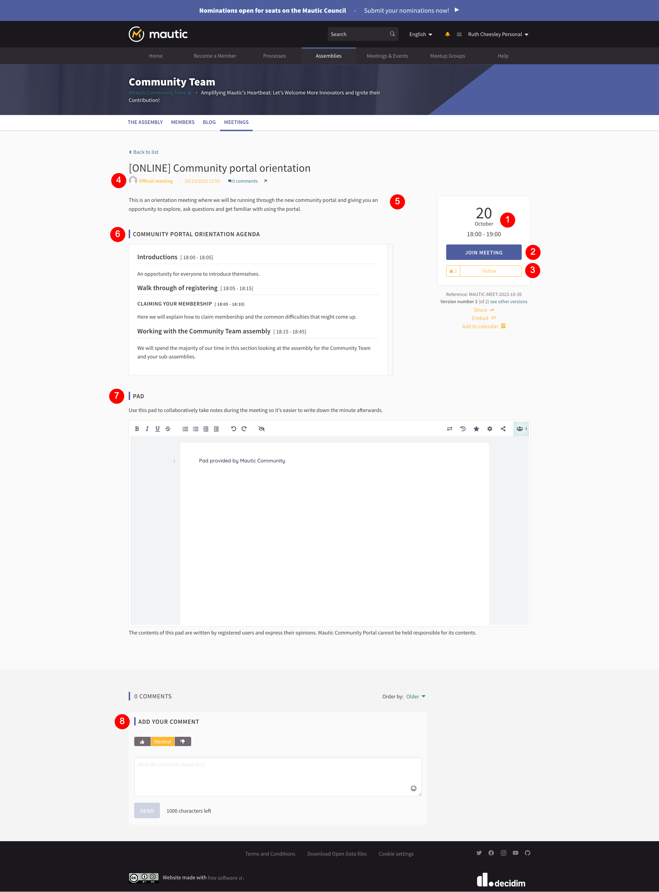
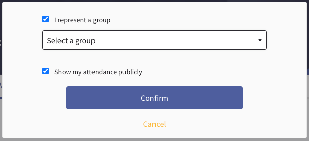

In this article we're going to be exploring assemblies, what they are, why they're important, why you might want to get involved with using them, and what you can do. 

If you prefer to watch this in video form, you can do that here:

<iframe width="560" height="315" src="https://www.youtube-nocookie.com/embed/fYg8yPQcgxM?si=ZcAQWmbJ1LSsMcky" title="YouTube video player" frameborder="0" allow="accelerometer; autoplay; clipboard-write; encrypted-media; gyroscope; picture-in-picture; web-share" allowfullscreen></iframe>

## Getting started with Assemblies

Assemblies can be found via the link on the main menu. When you access this page you will notice that there are some assemblies which are highlighted, followed by the full list of top level assemblies.

An assembly is a grouping of people who come together to make decisions about specific things or to run different parts of the community. 

We have different reasons for having assemblies. So some of them are relating to decision making and governance - such as the Council and the General Assembly - but there are also assemblies for Teams, Meetup Groups and Working Groups as well. 

An assembly can also have assemblies nested within it - for example the MautiCon Working Group is nested within the Community Team, because that is the team in which it belongs.   This is denoted by the card having a stacked appearance, and listing the number of assemblies within it,  as seen in the Community Team here.

## Exploring Assemblies

When you click through onto an assembly you will be presented with the overview page.

1. Where it has been set, there's a hashtag which relates to the specific assembly. 
2. The main page for an assembly will provide you with an overview which is basically the charter for that organised group -  what they do, and why they exist.
3. If this assembly has a finite time for existence -  for example if it exists to support a specific event -  this will be listed in the metadata of the page on the right hand side.
4. The follow button is common across the whole of the community portal,  allowing you to get updates from assemblies, groups, processes and so forth by clicking the button. Think of it as similar to following on social media pages
5. Each assembly will have a submenu with different components depending on the assembly's need
6. Any upcoming scheduled meetings will show in a list, and where there is an option you will be able to join the meeting by clicking through. After meetings are completed you will be able to view minutes and notes.
7. If an assembly has sub-assemblies they will be listed in this section.  Remember that assemblies **and** sub-assemblies can have assemblies within them!
8. At the very bottom of a page will be some statistics about the assembly.

### Members

An assembly has formal roles including:

* Lead
* Assistant lead
* Contributor
* Custom defined roles

When you click on the members item in the assembly menu it lists the formal members.

 

If you are interested in an assembly the best thing to do is to follow that assembly to get updates.  When you start practically contributing to an assembly in some way, the team will make you a contributor or whatever the formal role that's relevant for the assembly is called.

### Components

#### Blog

In the Community Team, you'll notice we've got a blog. Anything across the whole of the community portal can have a blog and they all get output into the activity feed, so it's a great way of keeping people apprised of what your team is working on and what your project is doing. 

In this case, you can see that there's an official post from the team asking for people who are interested in promoting Mautic in their local regions - to become ambassadors - to come and tell us that they're interested.

#### Meetings

Another popular component that we use in the portal is meetings.  Meetings can be online, hybrid or in person, and there is an option to filter using select boxes and a search box to show all meetings, upcoming meetings, past meetings, and also to filter by type.

There is an option to export the calendar, which is great if you want to ensure that the meetings for a particular assembly are in your personal calendar.  This creates a URL which you can subscribe to in your calendar of choice, so it is updated automatically.

Click on the meeting to learn more about what is being discussed.

1. On the right hand side you will be able to see the date and time for the meeting
2. There is a button to join the meeting,  which allows you to decide whether you want your participation to be shown publicly or not,  and also whether you are representing a group or yourself. Sometimes a meeting may use an external ticketing system, in which case 'join meeting' will take you to that system to complete the form. Once you register you will be able to access the link to access the online or hybrid meeting.

3. You can decide to follow the meeting if you want to get updates
4. In some assemblies, participants can create meetings as well as the group members.  You can tell the difference because if a meeting is created by a group member, it will be shown as an official meeting.
5. A description of the meeting in general tells you what will be discussed.
6. A formal agenda of what will be discussed and the rough timings for each section
7. An etherpad which allows you to take notes collaboratively during the meeting.  The pad becomes editable within 24 hours of the meeting start time, and will be available and editable for 72 hours after.  From that point it becomes read only. This allows people to participate asynchronously if they want to. It is required to be logged into the portal in order to edit the Etherpad.
8. Comments can be left on a meeting, and you can express positive support, neutral, or downvote along with leaving a comment if you wish. There is a maximum of 1,000 characters per comment.
